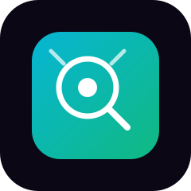

  

# 📸 PixelSage — Image Analyzer

A professional AI-powered image analyzer that describes every detail of your photo — from foreground to background — in one clean, natural paragraph.

## 📖 Overview

PixelSage uses a powerful vision-language model to understand and describe uploaded images in natural language. It reads the entire scene — foreground, middle ground, background, edges and corners — and returns a single, flowing description that reads like a human expert looking at your photo.

Built with a **multi-provider fallback architecture** so it never goes down: if one vision model runs out of credits or is unavailable, PixelSage automatically switches to the next one.

Perfect for accessibility, content tagging, visual understanding, and learning what's really inside an image.

## ✨ Features

- 📸 Upload JPG, JPEG, PNG, and WebP images
- 🧠 AI-powered descriptions via multiple vision models
- 🎚️ Three detail levels: Brief · Standard · Detailed
- 📝 Natural one-paragraph output (no reasoning leaks)
- 📚 History panel — auto-saves last 30 analyses with thumbnails
- ⚙️ Settings panel — adjustable detail level, temperature, and token limit
- 💾 Persistent settings and history (JSON-backed)
- 🎨 Beautiful dark UI with brand logo and sidebar
- 📋 Copy output as plain text
- 🔗 Multi-provider fallback (Gemini → Mistral → DeepSeek → OpenRouter)

## 🛠️ Tech Stack

| Layer | Technology |
|-------|-----------|
| Frontend | Streamlit |
| Vision (Primary) | Google Gemini 2.5 Flash |
| Vision (Fallback 1) | Mistral Pixtral 12B |
| Vision (Fallback 2) | DeepSeek Chat |
| Vision (Fallback 3) | Qwen 2.5 VL 7B (via OpenRouter) |
| Language | Python 3.10+ |
| Storage | Local JSON files (history.json, settings.json) |

## 🔗 Multi-Provider Architecture

PixelSage uses a provider chain so it never fails due to a single provider running out of credits:

🖼️ Vision → 1. Gemini 2.5 Flash (Google — multimodal)
              ↓ (fails)
           2. Pixtral 12B (Mistral — vision)
              ↓ (fails)
           3. DeepSeek Chat (DeepSeek — reasoning + vision)
              ↓ (fails)
           4. Qwen 2.5 VL 7B (via OpenRouter — free)
              ↓ (fails)
           ❌ Error

You only need one provider key to start, but adding all four means zero downtime.

## 📂 Project Structure

AI-Image-Recognizer/
├── app.py                # Main Streamlit app
├── requirements.txt      # Python dependencies
├── history.json          # Auto-generated — saved analyses
├── settings.json         # Auto-generated — saved preferences
├── thumbnails/           # Auto-generated — thumbnails for history
├── logos/
│   └── pixelsage.svg     # PixelSage logo (used in README and app)
├── .gitignore            # Git ignore rules
└── README.md

## ⚙️ Installation (Local)

1. Clone the repository

git clone https://github.com/Faizan-Ali-00/AI-Image-Recognizer.git
cd AI-Image-Recognizer

2. Create a virtual environment

Windows:
python -m venv venv
venv\Scripts\activate

macOS / Linux:
python3 -m venv venv
source venv/bin/activate

3. Install dependencies

pip install -r requirements.txt

4. Set up your API keys

Create a .env file in the root directory:

GEMINI_API_KEY=AIza_your_gemini_key_here
MISTRAL_API_KEY=your_mistral_key_here
DEEPSEEK_API_KEY=sk-your_deepseek_key_here
OPENROUTER_API_KEY=sk-or-v1-your_openrouter_key_here

You only need one of these to work. Add all four for maximum resilience.

## 🔑 Getting Free API Keys

| Provider | Free Tier | Get Key |
|----------|-----------|---------|
| Gemini | 15 RPM · 1,500 req/day | https://aistudio.google.com/app/apikey |
| Mistral | 1 req/sec · 500K tokens/min | https://console.mistral.ai/api-keys/ |
| DeepSeek | $5 free credit on signup | https://platform.deepseek.com/api_keys |
| OpenRouter | 50 req/day · 20+ free models | https://openrouter.ai/keys |

## 🚀 Deployment (Streamlit Cloud)

1. Push to GitHub

git add .
git commit -m "Deploy PixelSage"
git push origin main

2. Deploy on Streamlit Cloud

1. Go to https://share.streamlit.io/
2. Click New app
3. Select your repo: Faizan-Ali-00/AI-Image-Recognizer
4. Main file path: app.py
5. Click Deploy

3. Add your API keys as Secrets

Important: Never put API keys in app.py on GitHub — they become public. Use Streamlit Secrets instead.

1. Go to share.streamlit.io → your app → ⋮ → Settings
2. Click the Secrets tab
3. Paste your keys:

GEMINI_API_KEY = "AIza_your_gemini_key_here"
MISTRAL_API_KEY = "your_mistral_key_here"
DEEPSEEK_API_KEY = "sk-your_deepseek_key_here"
OPENROUTER_API_KEY = "sk-or-v1-your_openrouter_key_here"

4. Click Save → Reboot app

## ▶️ Usage

1. Upload an image (JPG, JPEG, PNG, or WebP)
2. Choose a detail level (Brief / Standard / Detailed)
3. Click Analyze Image
4. Read the natural-language description
5. Every analysis is auto-saved to the History panel

Each result also shows which vision provider answered.

## 🎛️ Settings

Open the ⚙️ Settings tab in the sidebar to configure:

| Setting | Description | Default |
|---------|-------------|---------|
| Detail Level | Length and depth of the description | Standard |
| Temperature | Creativity (0.0 – 1.0) | 0.4 |
| Max Tokens | Maximum response length | 900 |

Click Save Settings to persist them. Click Reset to Defaults to restore original values.

## 📚 History

Every analysis is automatically saved in the 📚 History tab (up to the last 30). Each entry includes:

- 🕐 Timestamp
- 🖼️ Thumbnail of the analyzed image
- 📝 Full description
- ⚙️ Detail level and provider used

You can View, Delete individual entries, or Clear All at once.

## 🎨 UI Highlights

- Brand logo — glowing magnifier mark with cyan/emerald gradient
- Dark theme — clean, professional image-analyzer look
- Chat-style result block — glowing border, labeled description
- Sidebar — brand logo, history tab, settings tab
- Chips row — shows image dimensions, mode, file size, detail level

## 🔒 Security Notes

- Never commit .env to GitHub
- Always use Streamlit Secrets for deployed apps
- Revoke keys immediately if accidentally exposed
- Store each provider's key separately for easy rotation
- On Streamlit Cloud, history.json and thumbnails/ are wiped when the app reboots

## 🤝 Contributing

1. Fork the repository
2. Create a feature branch: git checkout -b feature/AmazingFeature
3. Commit your changes: git commit -m "Add some AmazingFeature"
4. Push to the branch: git push origin feature/AmazingFeature
5. Open a Pull Request

## 📄 License

This project is licensed under the MIT License.

## 👤 Author

Faizan Ali
GitHub: https://github.com/Faizan-Ali-00
Repository: https://github.com/Faizan-Ali-00/AI-Image-Recognizer

## ⭐ Show Your Support

If this project helped you, please give it a star on GitHub — it means a lot!

## 🙏 Acknowledgments

Google Gemini — https://ai.google.dev
Mistral AI — https://mistral.ai
DeepSeek — https://deepseek.com
OpenRouter — https://openrouter.ai
Streamlit — https://streamlit.io
